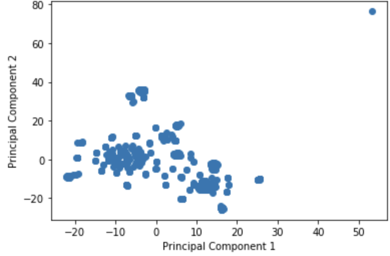
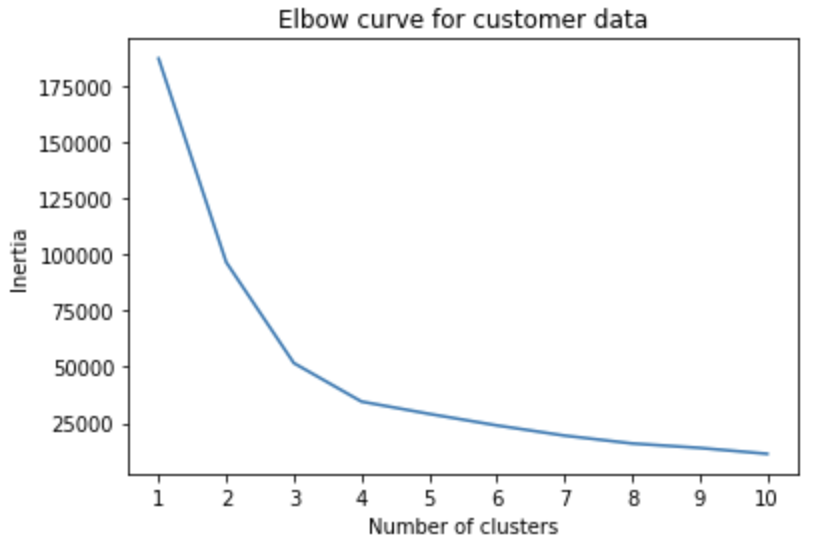
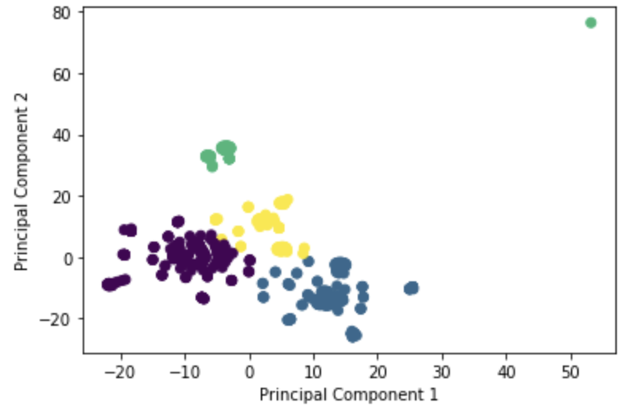

### Cryptocurrency-Cluster
#### <i> Use raw data and process it using unsupervise machine learning methods</i>

----------------------

**Description:**

Use several clustering algorithms to explore whether the cryptocurrencies can be grouped together with other similar cryptocurrencies and use data visualization to share findings with the investment bank.

* [Crypto Data](Resources/crypto_data.csv)

### Tools used:
----------------------

  - Python
  - Pandas
  - Jupyter
  - Matplotlib
  - SKLearn

### Analysis:
----------------------

#### PCA

Using PCA to reduce dimensions and preserve 90% of explained variance caused the number of columns to reduce from 98 to 74.

#### t-SNE

The t-SNE dimension reduction seems to give us two larger somewhat distinct clusters and two smaller but distinct cluster. It appears to be 4 clusters in total with some outliers.

#### Cluster Analysis & Recommendations

Based on my analysis and findings, I would recommend to the client that cryptocurrencies can be clustered together, and that the provided data suggests four clusters. One consideration to take into account is that there appears to be two significant outliers in the data. These could indicate either errors in the data or simply a significant difference between the other cryptocurrencies. I would recommend collecting more data to be certain that this model works, as we lost almost half the data during initial cleaning due to empty values or no trading being performed on that crypto.

